# SQL VS NoSQL: A hands-on Comparison of two Architectures.
#### TU Graz University - Knowledge Technologies Institute
1. [Introduction](##Introduction)  
2. [Implementation](#Implementation)  
  2.1. [Architecture](#Architecture)    
      A. [SQL](#SQL)  
      B. [NoSQL](#NoSQL)  
  2.2. [Methods](#Methods)    
      A. [Basic queries](#Basic_queries)  
      B. [Infer and correlate data](#Infer_and_correlate)  
      C. [Generate hypotheses](#hypotheses)  
3. [Discussion](#Discussion)  
  3.1. [Results](#Results)  
  3.2. [Conclusion](#Conclusion)  
4. [Appendix](#Appendix)  

## <a name="Introduction"></a>Introduction
When facing a new challenge regarding databases, probably the most important part is to decide the best architecture. Depending on the approach, not only the data will be store differently, but also the requests, the properties and the performance will change.
I will discuss the differences between using SQL and NoSQL to store and query environmental information of a student laboratory. Specifically, the technologies that were used for the experiment were PostgreSQL and Distributed Cassandra.
Regarding the data<sup>1</sup>, it was gathered from different type of sensors. It describes both the inside of the laboratory (how much energy it is used, the movement, luminosity, temperature, etc) and the outside (temperature, precipitation, humidity, wind, etc ).

## <a name="Implementation"></a>Implementation
The first implementation was a relational database, which means that it had the ACID properties (Atomicity, Consistency, Isolation and Durability). They are very reliable, but they do not scale easily and specific queries get too complex, especially when dealing with large amounts of data.
This problems described are very common nowadays in new applications, and this is where NoSQL comes into the scene. This kind of databases have BASE properties (Basic Availability, Soft-state and Eventual Consistency), from which one out of the three properties has to be ,  according to the CAP Theorem (displayed on the image on the right).
It may seem that NoSQL has no advantages in comparison with SQL, but this kind of architecture allows distribution, which is not only the cheapest way to grow the volume but also avoids single points on failure<sup>2</sup>.
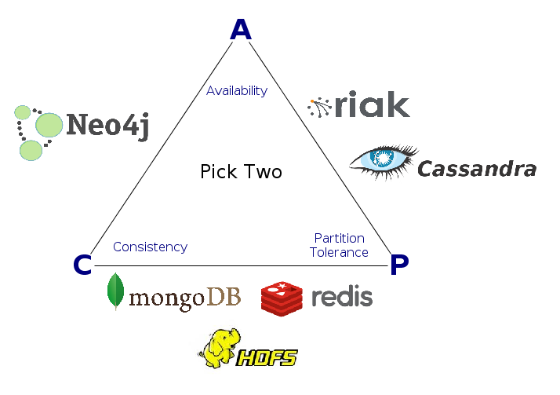
#### <a name="Architecture"></a>Architecture
On this section it will be described the architecture chosen for both of the implementations and described how queries varied.
###### <a name="SQL"></a>SQL
Initially, the data was formatted in PostgreSQL, and I used Postico to manage it. That data, therefore, was inside a relational database which contained two tables that could be accessed together through the “data” view. As said before, it contained information of many different sensors along a period of time, and depending of what it measured the value could be a timestamp, boolean, text, integer or float.
In the next image there is a screenshot of the first five rows of that view:  
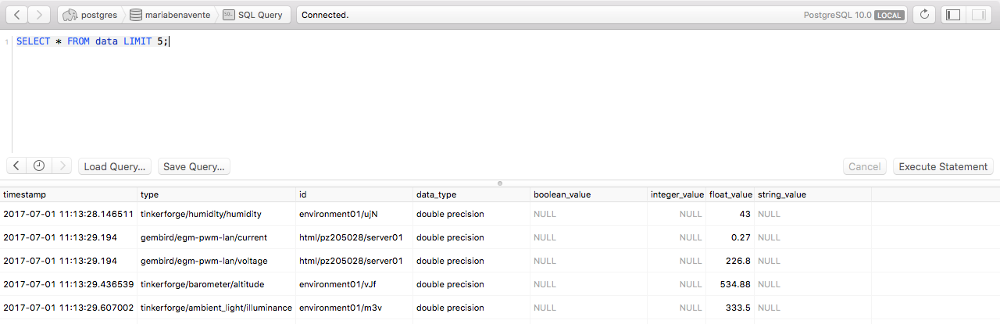

###### <a name="NoSQL"></a>NoSQL
I chose Cassandra because it performs well as a distributed database, because it is normally very fast and has eventual consistency. Also, “denormalization and duplication of data is a fact of life with Cassandra”<sup>3</sup>, and I wanted my second node to be  a replica of the first one.
The same data was exported from Postico to individual .cvs files – depending on the datatype it could be easily separated with a query:
```sql
SELECT * WHERE boolean_value IS NOT NULL;
```

This made the process very simple, as this new files were small enough to easily work with them, and no bulk import was needed. Here is a screenshot of this distributed Cassandra database:  
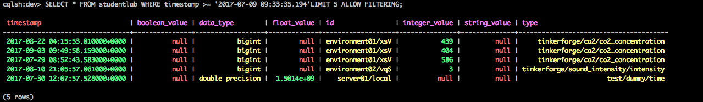
Which runned in two different nodes inside Docker:  
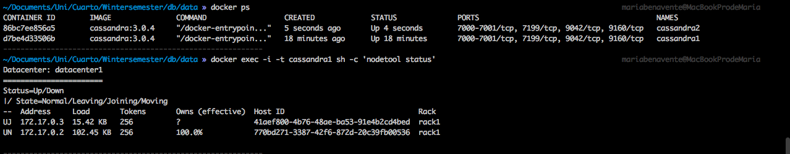
The keyspace of these nodes was created with Network Topology Strategy<sup>4</sup>, as there are “two datacenters”, with a replication factor of two, as there are only two nodes and I wanted one to be the copy of the other one. On the following images there is a description of the keyspace and the studentlab database:  
  
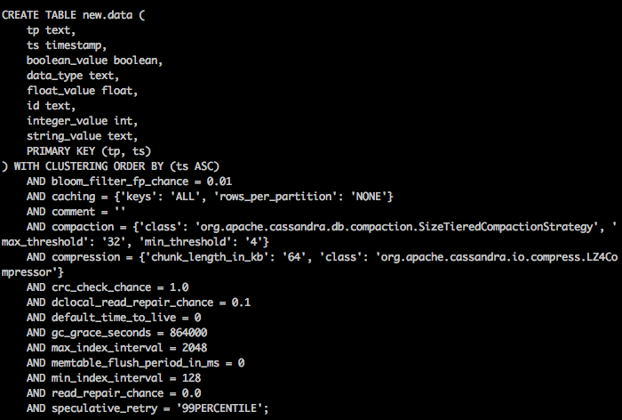

#### <a name="Methods"></a>Methods
The first queries were made for getting the shape of the data, and once I was familiarized with it, I went into more useful ones like retrieving specific data in order to get valuable information.
###### <a name="Basic_queries"></a>Basic queries
For the first query, I limited a time range and then showed the maximum, minimum and average of a specific value. The syntax of the first queries was very similar for Postgres and CQL, as seen below respectively:
```sql
SELECT * FROM data
   WHERE timestamp BETWEEN '2017-07-09 09:33:35.194' AND '2017-07-12 00:00:00';

SELECT * FROM new.data
   WHERE ts >= '2017-05-06 05:00:00+0000' AND ts <= '2017-07-12 00:00:00+1234'
   ALLOW FILTERING;
```
And the second part, which is more flexible with CQL, which does not need to “group by”, but made me change the structure (that is to say, create a new database with a different schema) so timestamp was primary key, as it can not be order by it anyway:
```sql
SELECT type, AVG(float_value), MAX(float_value), MIN(float_value) FROM data
   WHERE timestamp BETWEEN '2017-07-09 00:00:00' AND '2017-07-10 00:00:00'
         AND type LIKE 'openweathermap/current/temperature'
   GROUP BY type;

SELECT tp, AVG(float_value), MAX(float_value), MIN(float_value) FROM new.data
   WHERE ts >= '2017-07-01 00:00:00' AND ts <= '2017-08-01 00:00:00'
         AND tp = 'openweathermap/current/temperature'
   ALLOW FILTERING;
```
###### <a name="Infer_and_correlate"></a>Infer and correlate data
In the case that we want to infer some missing data, then we could choose between interpolating the data or just getting the last recorded value preceding the value of interest:
```sql
-- last value
SELECT value_of_interest FROM data
   WHERE timestamp <= 'wanted_timestamp' AND type LIKE 'value_of_interest'
   ORDER BY timestamp DESC
   LIMIT 1;

-- interpolation
SELECT AVG(value) FROM (
   SELECT * FROM (
      SELECT * FROM data
         WHERE timestamp <= 'wanted_timestamp' AND type LIKE 'value_of_interest'
         ORDER BY timestamp DESC
         LIMIT 1) AS prev
   UNION ALL
      SELECT * FROM (
         SELECT * FROM data
         WHERE timestamp >= 'wanted_timestamp' AND type LIKE 'value_of_interest'
         ORDER BY timestamp ASC
         LIMIT 1) AS next) subq
```
For example, using openweathermap/current/temperature as value_of_interest, and 2017-07-09 00:00:03 as the wanted_timestamp, the “last value” option retrieves 21 (recorded three seconds before) while “interpolation” gives 20.5, as the next recorded value– half an hour later– is 20.
```sql
-- last value
SELECT * FROM new.data
  WHERE ts <= 'wanted_timestamp' AND tp = 'value_of_interest'
  ORDER BY ts DESC
  LIMIT 1
  ALLOW FILTERING;

-- interpolation
-- DISCLAIMER: this query is not allowed Cassandra, subqueries must be triggered apart
SELECT AVG(value) FROM new.data WHERE ts IN (
  SELECT ts FROM new.data where ts > 'wanted_timestamp' LIMIT 1,
  SELECT ts FROM new.data where ts < 'wanted_timestamp' LIMIT 1
) ALLOW FILTERING;
```
As nested queries are not available in Cassandra<sup>5</sup>– the one above is a recreation–, the interpolation would have to be done manually combining two queries with the same structure at “last value”, that is to say, two queries like the one shown above<sup>6</sup>.
Also we may want to correlate some data, as can be the case of comparing the temperature inside and outside the office:
```sql
SELECT outdoors.date AS date, outdoors.t AS outTemp, indoors.t AS inTemp FROM (
  SELECT d.date, AVG(float_value) AS t FROM (
     SELECT to_char(date_trunc('day', (current_date - offs)), 'YYYY-MM-DD') AS date FROM generate_series(0, 365, 1) AS offs) d LEFT OUTER JOIN (
     SELECT * FROM data WHERE type LIKE 'openweathermap/current/temperature') data
     ON d.date = to_char(date_trunc('day', data.timestamp), 'YYYY-MM-DD')
  GROUP BY d.date) as outdoors
  INNER JOIN (
  SELECT d.date, AVG(float_value) AS t FROM (
    SELECT to_char(date_trunc('day', (current_date - offs)), 'YYYY-MM-DD') AS date FROM generate_series(0, 365, 1) AS offs) d LEFT OUTER JOIN (
  SELECT * FROM data WHERE  type LIKE 'tinkerforge/temperature/temperature') data
  ON d.date = to_char(date_trunc('day', data.timestamp), 'YYYY-MM-DD')  
  GROUP BY d.date) as indoors
  ON outdoors.date = indoors.date
WHERE outdoors.t IS NOT NULL AND indoors.t IS NOT NULL;
```
Here is a representation<sup>7</sup> of the output data, which confirms that there is a correlation between these two variables:  
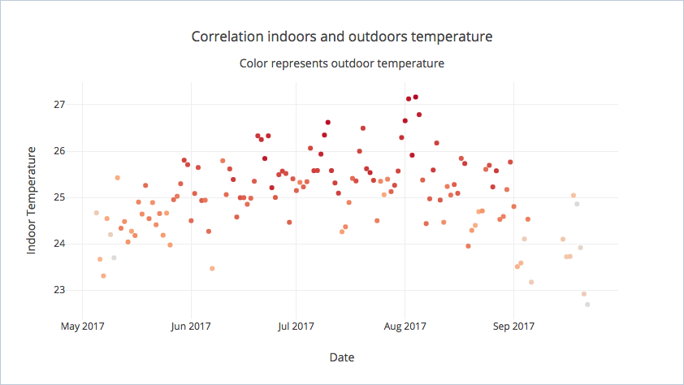
Again, the chosen data model does not allow in NoSQL make this kind of query, as nested in required. There is a detailed explanation of this point in the Discussion section.
###### <a name="hypotheses"></a>Generate hypotheses
As I said before, this is the part where we try to get information out of the data by generating hypotheses and verifying them. For example, with the stored information we can try to find out the following and then prove it by querying:
- When do people work? Define an approximate time range.
- Are people louder with good or bad weather?
- Do people open more or less the windows depending on the weather? This can be guessed by analysing the CO2 concentration.  

In order to generate those hypotheses it was necessary first to state the possible general values for people (not in the office or inside the office) and for weather (good or bad). I retrieved from the dataset the maximum, minimum and average values for the parameters of interest, and then chose how to divide the categories depending on them. The categorization was made using the following parameters from the database<sup>8</sup>:  
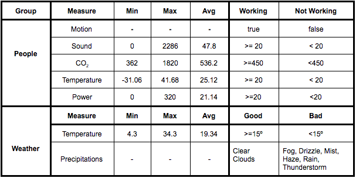  
I used the structure of the following query, along with the ones formerly presented, to get information out of the database:  
```sql
SELECT s.hour, t.sound FROM
  generate_series(0, 23) AS s(hour)
  LEFT OUTER JOIN (
     SELECT AVG(integer_value) AS sound, EXTRACT(hour from timestamp) AS hour
     FROM data WHERE date_trunc('day', timestamp) = '2017-08-01' AND type LIKE 'tinkerforge/sound_intensity/intensity'
  GROUP BY hour) AS t
  ON s.hour = t.hour;
```
My requests used also the information from the table above, which altogether made straightforward answer the following questions:
- When do people work? After checking movement, temperature and noise, I realised that the most determinant was the CO2 concentration, where it can be seen that there are people in the office from nine to six:  
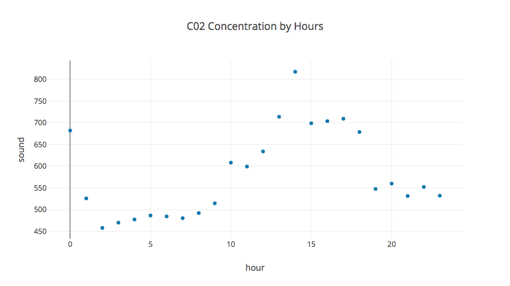  

- Are people louder with good or bad weather? Here I used a query similar to the correlation one, as I wanted to know if there is a relation between the temperature  and more noise in the office, and it looks like people are louder during Spring:  
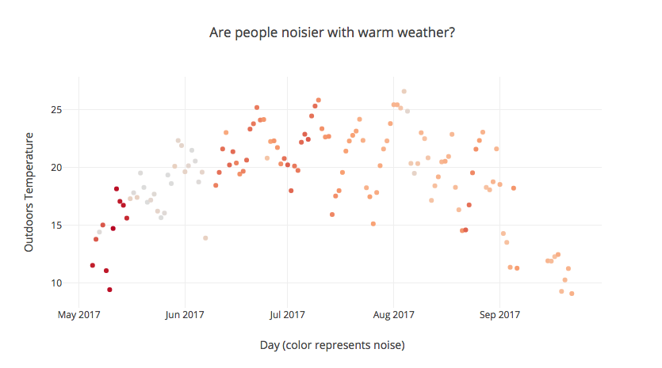  

- Do people open more or less the windows depending on the weather? There is no evidence proving whether this is true or false:  
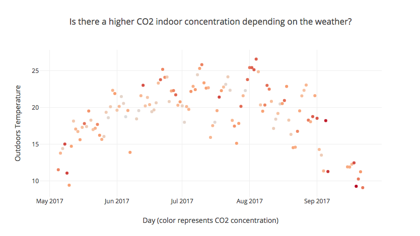  

Again, I could not find a way to define this complex queries in Cassandra, as in order to get this information it would have been necessary to define a different architecture<sup>9</sup>. All of this would have to be separated queries with my NoSQL structure. Again, without a previous planification of how the data will be used, the queries are very limited without map-reduce.  

## <a name="Discussion"></a>Discussion  
On this last part, I will discuss the results above, along with my personal experience working on this project and my conclusion of it.  
#### <a name="Results"></a>Results  
First of all, I will state that this was my first time using a NoSQL distributed architecture, but I have previous experience with SQL. Also, I do not have a a lot of experience using Docker, which also brought me problems while loading the files. Whenever I tried to use Cassandra as a relational DB, which it is not, I failed, as I should implemented map-reduce.
I found very costly building the NoSQL, even taking into account that I did not find the right architecture to solve all the requests. What does this mean? For this specific scenario where we want to make punctual and and varied queries, it might be better to use relation database. It will be in moments where:
- The volume of data is too big and needs to be distributed.
- Data is too complex or different, like for big data.
- It is used a lot like and needs to be fast, like in the case of content deliveries.
I can see that brings great benefits, both in time and money, when used for any of the listed reasons. For this specific scenario, the time cost of migrating to NoSQL was not worthy in my opinion, as I did not fully took advantage of it benefits.

#### <a name="Conclusion"></a>Conclusion  
My final conclusion of the exercise is that NoSQL architectures should be used where they make sense – they should be used only when we need the benefits listed on the Introduction and the purpose of all the data should be studied beforehand. For this particular case, there are more adequate types of NoSQL databases, like time based ones, but I think that the use of a SQL database was good for this particular case.
I believe that the queries will be simpler with an adequate schema, but the data model will have to be chosen carefully and planificate in advance what will be the use of the database. I found this personal opinion supported by an article at DataStax<sup>11</sup>: The complexity trade-off for Apache Cassandra is in knowing about your queries and data access patterns ahead of time.
Even though my achievements implementing the database in Cassandra might seem poor, I believe I learnt an important lesson while working simultaneously with two kinds of databases, as I could compare them in real time. I could experience how setting up the schema and environment for a distributed database is far more complex than for a traditional one, but once it runs with the proper architecture, the use of it is simpler.

## <a name="Appendix"></a>Appendix  
The appendix shows the execution time of a counting query. Note that I limited the queries in Postico because there are less entries in the NoSQL database due to importing errors:  
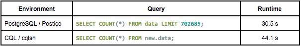

The time of the Postgres queries was displayed in Postico’s interface. As I am using CQL from the terminal, I had to enable tracing and then display the results:
```sql
cqlsh> enable tracing;
cqlsh> select * from system_traces.sessions;
```
Here is an example:  
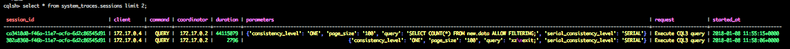

## Footnotes  
<sup>1</sup> http://kti.tugraz.at/staff/rkern/courses/dbase2/data/studentlab.zip  
<sup>2</sup> https://www.hakkalabs.co/articles/how-to-switch-user-database-from-postgres-to-cassandra-on-a-running-system  
<sup>3</sup> https://www.datastax.com/dev/blog/basic-rules-of-cassandra-data-modeling  
<sup>4</sup> http://docs.datastax.com/en/archived/cassandra/1.2/cassandra/architecture/architectureDataDistributeReplication_c.html  
<sup>5</sup> https://stackoverflow.com/questions/27460129/nested-query-not-working-in-cassandra  
<sup>6</sup> My solution was inspired in this subquery approach.  
<sup>7</sup> http://cassandrapowerfulnosql.blogspot.com.es/2015/03/sub-query-in-cassandra.html  
<sup>8</sup> Every graph on this paper is the output of a query exported to a .csv file and displayed with the Python library Plotly.  
<sup>9</sup> Note that this table has approximate values, as this data is not focus of the paper – the import part in the way we deal with it, not the results. That is to say, there is imprecise data, as for example the indoors sound average should have removed the zero values, etc.  
<sup>9</sup> https://issues.apache.org/jira/browse/CASSANDRA-11871  
<sup>10</sup> https://www.talend.com/resource/cassandra-hadoop-integration/  
<sup>11</sup> https://www.datastax.com/dev/blog/the-most-important-thing-to-know-in-cassandra-data-modeling-the-primary-key  
